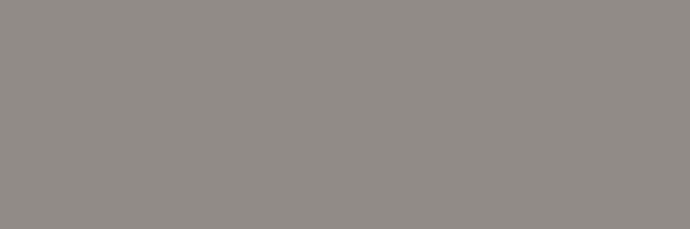
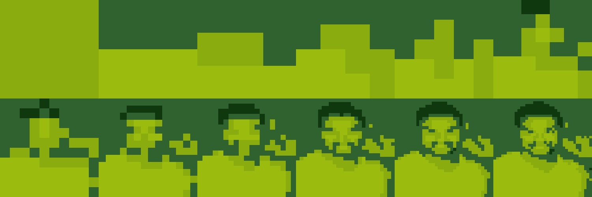
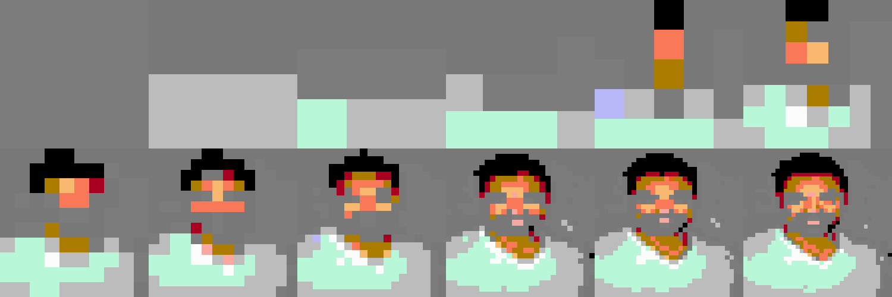
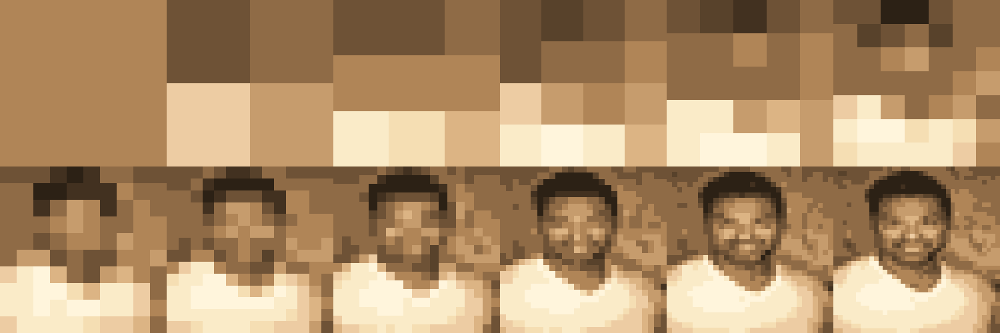

# PixelMe

Turn any profile photo into a pixel-art progression banner for social media.



Each banner shows your avatar evolving from a single pixel to a recognizable (but still pixelated) portrait — a visual journey through resolution.

## Inspiration

This project was inspired by [Travis LeRoy Southworth](https://www.travisleroyart.com/)'s [*I'm a Square*](https://opensea.io/collection/i-m-a-square) (2021) — a 24-piece NFT collection that deconstructs a self-portrait into progressive levels of pixelation.

The series asks a deceptively simple question: **how many pixels does it take to recognize a person?** Starting from a single color block and ending at a CryptoPunks-style 24x24 grid, each piece strips digital identity down to its most basic element — the square.

The title itself is a double entendre: literally "I am a square (pixel)," but also the self-deprecating slang for being uncool — a wink at the absurdity of pixel-art PFP culture.

PixelMe lets anyone create their own version of this progression as a social media banner.

## Output

Generates banners for 3 platforms — both static PNG and animated GIF:

| Platform | Size | Layout |
|----------|------|--------|
| X / Twitter | 1500 x 500 | 6 x 2 |
| Facebook | 820 x 312 | 5 x 2 |
| Substack | 1500 x 300 | 10 x 2 |

The GIF animates from 1x1 through each pixelation stage, auto-looping.

## Previews

### Sample 1

**Twitter (static)**


**Twitter (animated)**


**Facebook**


**Substack**


---

### Sample 2

**Twitter (static)**


**Twitter (animated)**


**Facebook**


**Substack**


---

### Sample 3

**Twitter (static)**


**Twitter (animated)**


**Facebook**


**Substack**


## Color Palettes

4 built-in palettes: `original`, `gameboy`, `nes`, `sepia`

| Palette | Preview |
|---------|---------|
| **Original** |  |
| **GameBoy** |  |
| **NES** |  |
| **Sepia** |  |

## Features

- **Animated GIF** — auto-looping de-pixelation effect (auto-plays on Twitter/X)
- **4 color palettes** — original, GameBoy, NES, sepia (or `--all-palettes`)
- **Floyd-Steinberg dithering** — `--dither` for smoother palette gradients
- **Resolution labels** — `--labels` adds "Npx" text to each cell
- **Platform presets** — Twitter, Facebook, Substack (or `--size WxH` for custom)
- **Single platform** — `--platform twitter` to generate just one

## Usage

```bash
pip install -r requirements.txt

# Default (reads avatar.png, outputs to current directory)
python main.py

# Custom input and output directory
python main.py photo.png -o output_dir/

# With color palette
python main.py photo.png -p gameboy

# All palettes at once
python main.py photo.png --all-palettes

# With Floyd-Steinberg dithering (smoother gradients)
python main.py photo.png -p sepia --dither

# With resolution labels on each cell
python main.py photo.png --labels

# Single platform only
python main.py photo.png --platform twitter

# Custom banner size (e.g. YouTube)
python main.py photo.png --size 1920x1080

# See all options
python main.py --help
```

### Web UI

```bash
streamlit run app.py
```

Upload a photo, pick a platform and palette, click Generate. Download PNG or GIF directly.

## License

Sample photos from [Unsplash](https://unsplash.com) (free license).
