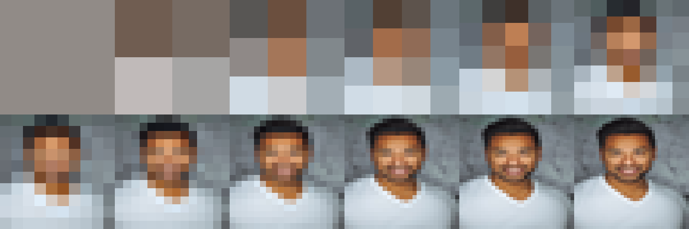
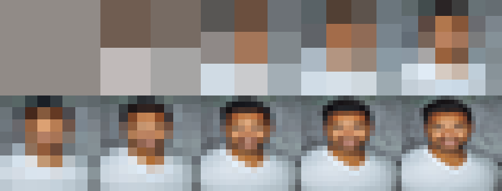
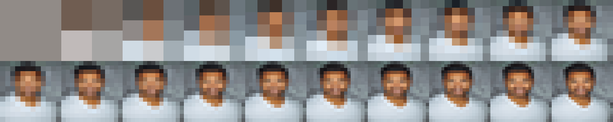
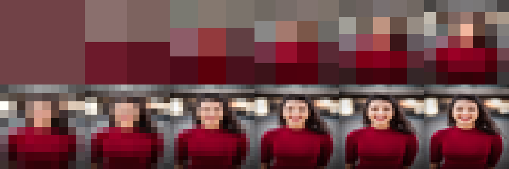
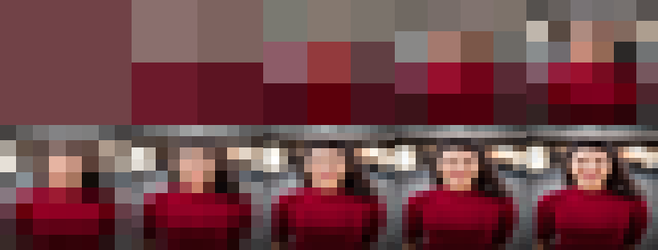
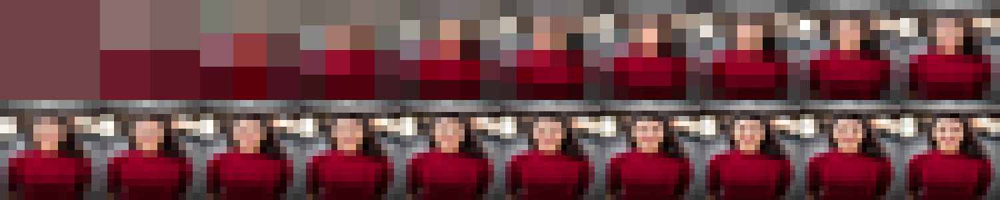
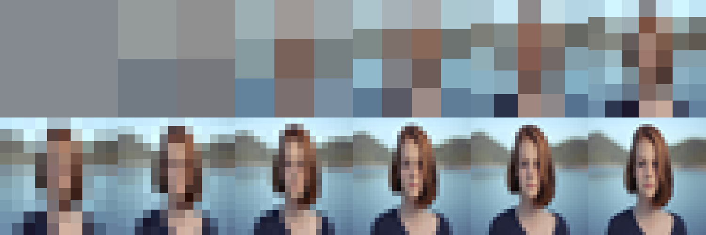
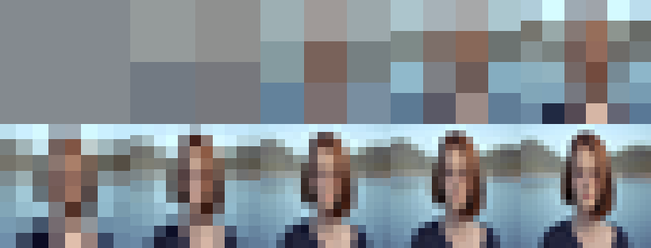
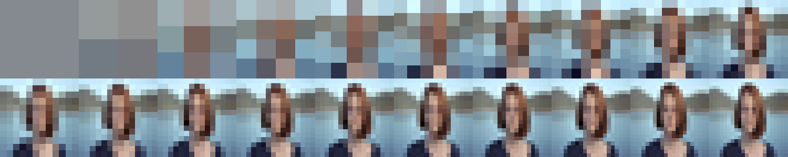

# PixelMe

Turn any profile photo into a pixel-art progression banner for social media.

Each banner shows your avatar evolving from a single pixel to a recognizable (but still pixelated) portrait — a visual journey through resolution.

## Inspiration

This project was inspired by [Travis LeRoy Southworth](https://www.travisleroyart.com/)'s [*I'm a Square*](https://opensea.io/collection/i-m-a-square) (2021) — a 24-piece NFT collection that deconstructs a self-portrait into progressive levels of pixelation.

The series asks a deceptively simple question: **how many pixels does it take to recognize a person?** Starting from a single color block and ending at a CryptoPunks-style 24x24 grid, each piece strips digital identity down to its most basic element — the square.

The title itself is a double entendre: literally "I am a square (pixel)," but also the self-deprecating slang for being uncool — a wink at the absurdity of pixel-art PFP culture.

PixelMe lets anyone create their own version of this progression as a social media banner.

## Output

Generates banners for 3 platforms:

| Platform | Size | Layout |
|----------|------|--------|
| X / Twitter | 1500 x 500 | 6 x 2 |
| Facebook | 820 x 312 | 5 x 2 |
| Substack | 1500 x 300 | 10 x 2 |

## Previews

### Sample 1

**Twitter**


**Facebook**


**Substack**


---

### Sample 2

**Twitter**


**Facebook**


**Substack**


---

### Sample 3

**Twitter**


**Facebook**


**Substack**


## Usage

```bash
pip install Pillow

# Default (reads avatar.png, outputs to current directory)
python main.py

# Custom input and output directory
python main.py path/to/photo.png output_dir/
```

## License

Sample photos from [Unsplash](https://unsplash.com) (free license).
